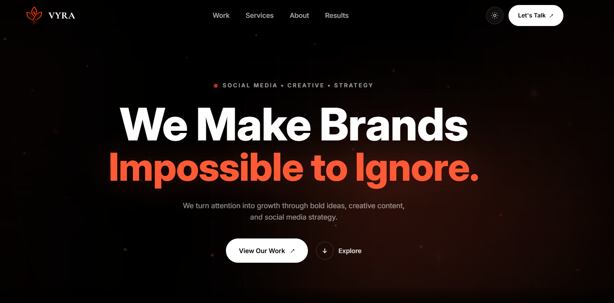

# VYRA

<p align="center">
  
</p>

<p align="center">
  <strong>Social media. Creative direction. Brand presence.</strong><br />
  A focused portfolio experience for bold ideas and memorable digital identities.
</p>

<p align="center">
  
</p>

## Overview

VYRA is a polished, responsive social media portfolio for showcasing creative work, strategic services, client testimonials, and contact channels in one memorable single-page experience.

The interface combines editorial typography, expressive motion, glass-inspired navigation, and a persistent light/dark theme. It is designed to be easy to adapt for a creator, agency, or personal brand.

## Features

- Responsive layout for desktop, tablet, and mobile screens.
- Dark mode by default with a persistent light mode option.
- Mobile navigation with clear, accessible controls.
- Scroll-reveal animations for key content sections.
- Dedicated sections for work, services, about, results, testimonials, and contact.
- Social contact links for Instagram, Telegram, and WhatsApp.
- Brand assets, favicon, and social preview metadata ready for publishing.
- Type-safe React components with ESLint validation.

## Tech stack

| Layer | Technology |
| --- | --- |
| UI | React 19 |
| Language | TypeScript |
| Build tool | Vite |
| Styling | Tailwind CSS 3 |
| Code quality | ESLint |

## Getting started

### Prerequisites

- Node.js 20 or newer
- npm 10 or newer

### Installation

```bash
git clone <your-repository-url>
cd social-media-portfolio
npm install
```

### Development

```bash
npm run dev
```

Open the local URL shown by Vite, usually `http://localhost:5173`.

### Production build

```bash
npm run build
npm run preview
```

## Available scripts

| Command | Description |
| --- | --- |
| `npm run dev` | Starts the Vite development server. |
| `npm run lint` | Checks the codebase with ESLint. |
| `npm run build` | Type-checks and creates the production bundle. |
| `npm run preview` | Serves the production build locally. |

## Customization

Before publishing, update the project content in these areas:

1. **Branding:** Replace the logo and preview images in `public/icon/` and `public/img/`.
2. **Social links:** Update the URLs in `src/components/layout/Navbar.tsx` and `src/components/sections/Contact.tsx`.
3. **Testimonials:** Edit the content in `src/data/testimonials.ts`.
4. **Services and portfolio:** Adjust the copy, links, and images in the section components under `src/components/sections/`.
5. **Metadata:** Update the title, description, favicon, and social preview values in `index.html`.

## Project structure

```text
.
├── public/
│   ├── icon/             Brand mark and favicon assets
│   ├── img/              Portfolio preview images
│   └── svg/              Service and interface icons
├── src/
│   ├── components/
│   │   ├── layout/       Navigation and shared layout pieces
│   │   └── sections/     Hero, about, services, testimonials, contact
│   ├── data/             Structured testimonial content
│   ├── hooks/            Reusable interaction hooks
│   ├── App.tsx           Main page composition
│   ├── index.css         Global styles, theme, and motion
│   └── main.tsx          Application entry point
├── index.html            Document metadata and app root
├── tailwind.config.js    Tailwind theme configuration
└── package.json           Scripts and dependencies
```

## Theme behavior

VYRA starts in dark mode. Visitors can switch themes from the navigation bar, and the selected preference is stored in `localStorage` for future visits.

## Deployment

The project produces a static `dist/` directory after `npm run build`, so it can be deployed to Vercel, Netlify, GitHub Pages, Cloudflare Pages, or any static hosting provider.

For single-page hosting, configure a fallback to `index.html` so anchor navigation and future client-side routes continue to work correctly.

## License

This project is a personal portfolio template. Adapt the content, contact details, and visual assets to your own brand before publishing.
